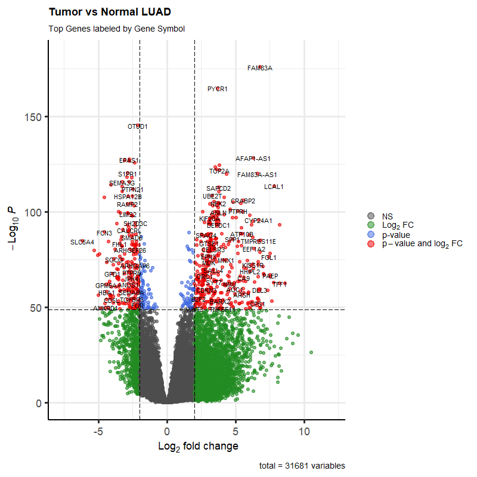

# TCGA-LUAD-RNAseq-Analysis

## Overview
This repository contains a reproducible R-based workflow for the analysis of Lung Adenocarcinoma (LUAD) RNA-seq data from TCGA. The project focuses on characterizing transcriptional shifts, evaluating biomarker performance, and analyzing differences between molecular subtypes (PP vs TRU).

## Key Highlights
- **Differential Expression:** Identified 24,073 significant genes (adj. P < 0.05) between tumor and normal samples.  
- **Biomarker Evaluation:** Assessed **TOP2A** as a tumor-associated marker, achieving an AUC of 0.988.  
- **Subtype Analysis:** Compared PP and TRU subtypes, identifying 9,657 dysregulated genes.  
- **Biological Interpretation:** Pathway analysis revealed strong enrichment of mitotic and chromosome segregation processes in the PP subtype.  

## Technologies Used
- **Language:** R  
- **Bioinformatics:** DESeq2, limma, clusterProfiler, TCGAbiolinks  
- **Statistical Analysis:** pROC  
- **Visualization:** EnhancedVolcano, ggplot2  

## Project Structure
- `/scripts` — R scripts for the analysis pipeline  
- `/plots` — Figures (volcano, ROC, pathway enrichment)  
- `/results` — Output tables (DEGs, targets)  
- `/reports` — HTML analysis report  

## Technical Notes
Raw data was obtained from the GDC portal and is not included due to size constraints. Batch-associated variation was assessed and adjusted for visualization, while differential expression modeling was performed using a simplified design to avoid confounding.
