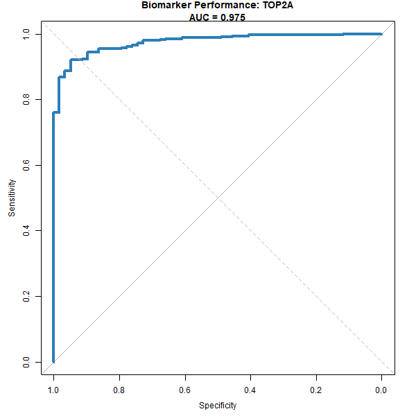
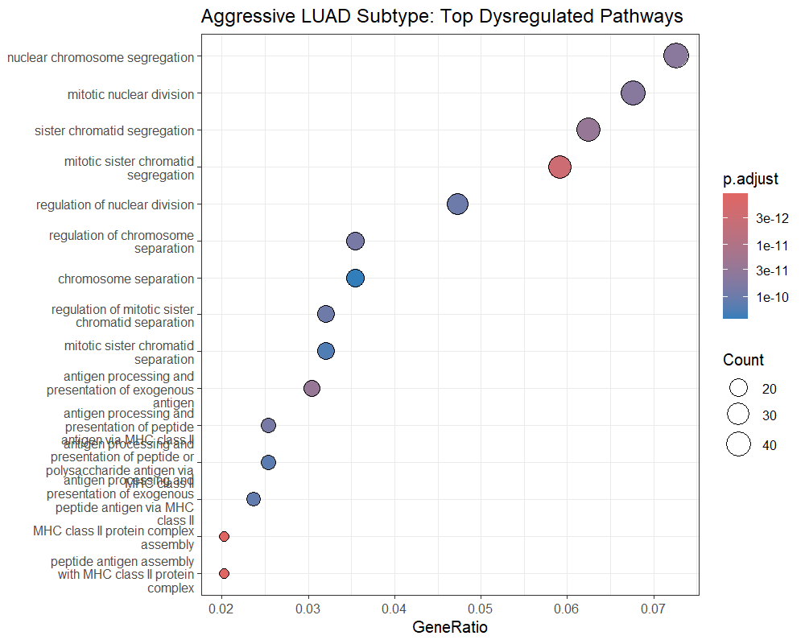

## Project Overview

This project presents a computational analysis of RNA-seq data from the TCGA Lung Adenocarcinoma (LUAD) cohort.
The objective was to characterize transcriptional differences between tumor and normal tissue, evaluate the performance of selected biomarkers, and explore expression differences across molecular subtypes.

All analyses were performed in R using Bioconductor-based workflows.

------------------------------------------------------------------------

## 1. Differential Expression and Technical Considerations

Differential expression analysis was performed using **DESeq2** to compare tumor samples against solid tissue normal controls.

A large transcriptional shift was observed, with 24,073 genes meeting the adjusted significance threshold ($adj. P < 0.05$), consistent with widespread dysregulation in tumor tissue.

**Technical Note on Batching:**\
Inspection of metadata indicated confounding between tissue source sites and sample types, a known characteristic of TCGA datasets.
To maintain model stability, a simplified design formula was used for differential expression.
Batch-associated variation was adjusted for visualization purposes using `limma::removeBatchEffect`, ensuring that statistical inference remained focused on the biological condition.

```{r volcano, echo=FALSE, fig.align='center', out.width='75%'}
knitr::include_graphics('../plots/volcano_plot.png')
```

## 2. Biomarker Evaluation: TOP2A

TOP2A was selected for further evaluation based on its strong differential expression (log2FC ≈ 3.85, adjusted P-value \< 1e-120).

A Receiver Operating Characteristic (ROC) analysis was performed to assess its ability to distinguish tumor from normal samples.

-   **Observed Result:** An Area Under the Curve (AUC) of 0.988 was obtained.

-   **Interpretation:** This indicates strong discriminatory performance within the TCGA dataset.
    However, such high performance is expected in tumor-versus-normal comparisons and may not generalize to independent cohorts.
    TOP2A is a known marker of cellular proliferation, and its elevated expression is consistent with malignant biology rather than indicative of standalone diagnostic utility.

```{r roc, echo=FALSE, fig.align='center', out.width='55%'}

```

## 3. Exploratory Subtype Analysis: PP vs. TRU

A secondary analysis compared the Proximal Proliferative (PP) and Terminal Respiratory Unit (TRU) molecular subtypes.

**Transcriptional Shift:** A large number of genes (9,317) met the adjusted significance threshold ($adj. P < 0.05$), indicating substantial differences between subtypes.

**Functional Interpretation:** Pathway enrichment analysis suggested that the PP subtype is associated with mitotic and cell cycle-related processes, consistent with previously reported proliferation-driven characteristics of this subtype.

```{r pathway, echo=FALSE, fig.align='center', out.width='80%'}

```

## 4. Summary of Biologically Relevant Targets

Several highly dysregulated genes identified in this analysis are associated with known biological mechanisms and therapeutic research:

| Gene | Biological Association | Context |
|:-----------------|:------------------------|:----------------------------|
| **TOP2A** | DNA topology regulation | Target of topoisomerase II inhibitors (e.g., etoposide) |
| **AURKA** | Mitotic regulation | Mitotic kinase with ongoing investigational interest |
| **CDK1** | Cell cycle progression | Central regulator of mitosis; relevant to cell cycle-targeted studies |

These associations highlight biological relevance but do not imply direct clinical applicability.

## Limitations and Future Directions

**Dataset Dependency:** Observed performance metrics (e.g., ROC AUC) are specific to this dataset and require validation in independent cohorts (e.g., GEO).

**Bulk RNA-seq Constraints:** Results represent averaged signals across heterogeneous tumor and microenvironmental cell populations.

**Batch Effects:** Confounding between tissue source sites and sample types was mitigated but not fully resolved due to dataset structure.

**Validation:** Biomarker performance was evaluated within the same dataset; external validation would be required for robust assessment.

## Tools

**R/Bioconductor:** TCGAbiolinks, DESeq2, limma, clusterProfiler, pROC, ggplot2, EnhancedVolcano
